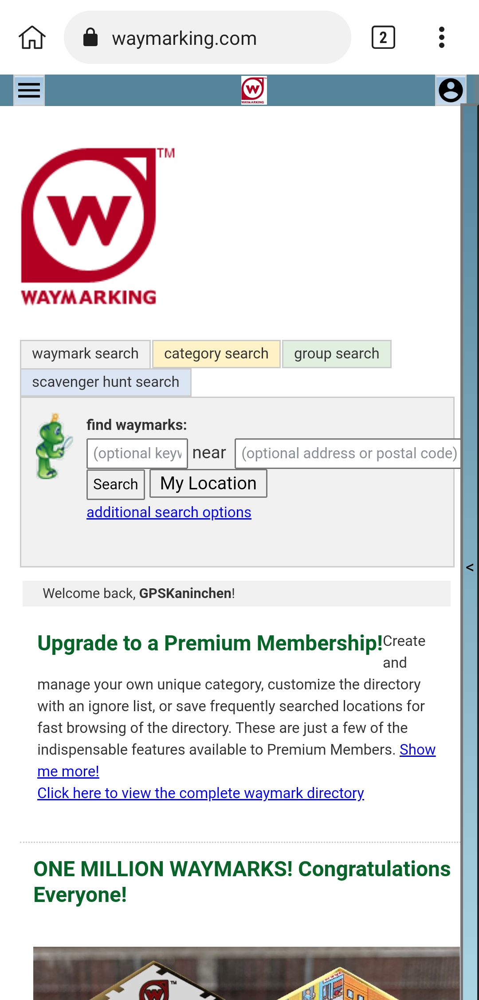

# Waymarking Tweaks

Waymarking is a game similar to Geocaching, just without physical containers. You can visit real-world locations and log your visits on the Waymarking website.

Unfortunately, [waymarking.com](https://www.waymarking.com/) is up since 2005 and did not recieve major updates since about 2007 / 2008. So it looks okay (not good imo, but usable) on Desktop browsers, but awful on mobile devices.

Since Waymarking is mostly an outdoor activity and technology has evolved since that time (You take your smartphone everywhere nowadays), the website badly needs a UI for mobile devices (or an Android App, like [Waymarkly](https://apps.apple.com/app/waymarkly-a-waymarking-app/id1485909913?uo=4) for iOS).

This userscript tries to modify the website to make the overall site appearance a bit more mobile friendly.

## How to use

You need a mobile browser that supports extensions.

I am using [Kiwi Browser](https://play.google.com/store/apps/details?id=com.kiwibrowser.browser) on my android smartphone. [Flow Browser](https://play.google.com/store/apps/details?id=org.flow.browser) should also work.

[Firefox](https://play.google.com/store/apps/details?id=org.mozilla.firefox) only supports very few extensions and currently no userscript manager extension, so this will not work.

I don't know if there is a mobile browser with extension support for iOS.

If you have found a browser that supports extensions, install a userscript manager, e.g. the [TamperMonkey Chrome extension](https://chrome.google.com/webstore/detail/tampermonkey/dhdgffkkebhmkfjojejmpbldmpobfkfo).

After that, **click [HERE](https://raw.github.com/MaxEtMoritz/WaymarkingTweaks/main/Waymarking%20Tweaks.user.js) to install** (from the browser with the userscript manager installed).

If this doesn't work, look for an option to install a userscript by URL and enter https://raw.github.com/MaxEtMoritz/WaymarkingTweaks/main/Waymarking%20Tweaks.user.js.

## Features

- "My Location" button that inserts your current location in the Waymark / Scavenger hunt search field

- Menu as expandable top bar

- Sidebar collapsed to the right

- fit screen size of the smartphone

- some size adjustments (not that good yet)

## Example Screenshots
|Before|After|
|:----:|:-----:|
|||
